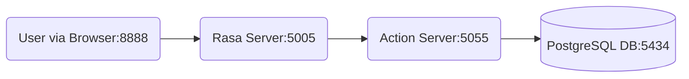

# Rasa Reminder Chatbot

A Rasa-based chatbot application capable of setting, listing, and managing reminders, integrated with a PostgreSQL database and accessible via a simple Web UI.

## Architecture Overview



*   **User:** Interacts via the Web UI served on port 8888.
*   **Rasa Server:** Handles NLU/Dialogue, listens on port 5005.
*   **Action Server:** Executes custom Python code, listens on port 5055.
*   **PostgreSQL DB:** Stores reminder data, accessed by Action Server, exposed on host port 5434.

For a more detailed diagram and explanation, see [`docs/diagrams.md`](./docs/diagrams.md).

## Features

*   Interact with the Rasa bot via a Web UI or the Rasa API.
*   Set reminders with specific tasks (date/time parsing currently disabled due to dependencies).
*   List existing reminders.
*   Delete reminders.
*   Persistence using a PostgreSQL database.
*   Dockerized environment for easy setup and deployment.

## Prerequisites

*   [Docker](https://docs.docker.com/get-docker/)
*   [Docker Compose](https://docs.docker.com/compose/install/) (v1 or v2)
*   [Python 3](https://www.python.org/downloads/) (for the `start_rasa_app.sh` script's web server)

## Setup

1.  **Clone the repository:**
    ```bash
    git clone <your-repository-url>
    cd rasa_project
    ```
2.  **(Optional) Configure Environment Variables:** Create a `.env` file based on `.env.template` (if provided) to customize database credentials, API keys, etc. Currently, defaults are used in `docker-compose.yml`.

## Running the Application

1.  **Make the start script executable (first time only):**
    ```bash
    chmod +x start_rasa_app.sh
    ```
2.  **Run the start script:**
    ```bash
    ./start_rasa_app.sh
    ```
    This script will:
    *   Build Docker images if necessary.
    *   Start the Rasa server, Action server, and PostgreSQL database containers.
    *   Start a simple Python HTTP server to serve the Web UI.

## Accessing the Application

*   **Web UI:** Open your browser and navigate to `http://localhost:8888` (or the port specified in `start_rasa_app.sh` if changed).
*   **Rasa HTTP API:** `http://localhost:5005`
*   **Action Server:** `http://localhost:5055` (usually not accessed directly)
*   **Database (from host):** Connect to PostgreSQL on `localhost:5434` (or the host port mapped in `docker-compose.yml`)

## Stopping the Application

*   Press `Ctrl+C` in the terminal where `./start_rasa_app.sh` is running. The script will automatically shut down the Docker containers and the Web UI server.
*   Alternatively, run `docker-compose down` from the project root directory.

## Project Structure

```
.
├── actions/              # Custom Rasa actions code (actions.py)
├── data/                 # NLU training data, stories, rules
├── docs/                 # Detailed documentation (including diagrams.md)
├── models/               # Trained Rasa models
├── webui/                # Simple Web UI files (HTML, CSS, JS)
├── config.yml            # Rasa pipeline and policy configuration
├── credentials.yml       # Configuration for external channels (e.g., Slack, Twilio)
├── domain.yml            # Bot's domain (intents, entities, slots, responses, actions)
├── endpoints.yml         # Configuration for action server, tracker store, etc.
├── docker-compose.yml    # Docker Compose configuration
├── Dockerfile            # Dockerfile for Rasa/Action server image
├── requirements.txt      # Python dependencies
├── start_rasa_app.sh     # Script to start the application stack
└── README.md             # This file
```

## Further Documentation

For more detailed information, please refer to the documents in the [`docs/`](./docs/) directory.