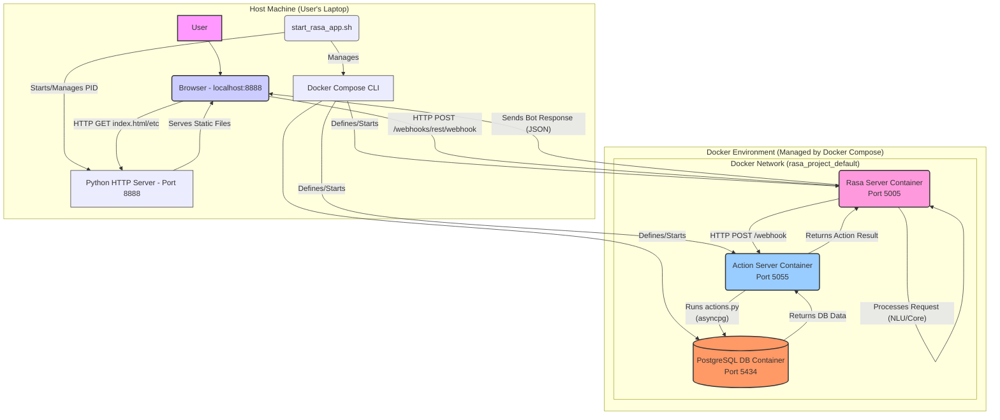

# Detailed Architecture Diagram

This diagram provides a more detailed view of the system components, their interactions, and the infrastructure setup.

## Diagram Explanations

*   **Host Machine:** Represents the user's local computer.
    *   **User:** Interacts with the system via a web browser.
    *   **Browser:** Loads the Web UI (`index.html`, `style.css`, `script.js`) from the Python HTTP Server and communicates with the Rasa Server container.
    *   **`start_rasa_app.sh`:** The main script used to start and stop the application stack. It orchestrates Docker Compose and the Python HTTP Server.
    *   **Python HTTP Server:** A simple server started by the script to serve the static files for the Web UI from the `webui/` directory.
    *   **Docker Compose CLI:** Used by the start script to manage the Docker containers based on `docker-compose.yml`.
*   **Docker Environment:** Represents the containerized part of the application.
    *   **Docker Network:** An internal network created by Docker Compose allowing containers to communicate using service names (e.g., `action_server` can connect to `db`).
    *   **Rasa Server Container:** Runs the main Rasa application. Handles NLU, dialogue management, and communicates with the outside world (via the Browser) and the Action Server. Exposed on host port 5005.
    *   **Action Server Container:** Runs the custom Python actions (`actions.py`). Executes custom logic, interacts with the database, and responds to the Rasa Server. Exposed on host port 5055.
    *   **PostgreSQL DB Container:** Stores persistent data (reminders). Accessed by the Action Server. Exposed on host port 5434.
*   **Interactions:** Arrows indicate the direction of requests or data flow.
    *   Web UI requests (`/webhooks/rest/webhook`) go to the Rasa Server.
    *   Rasa Server calls the Action Server (`/webhook`).
    *   Action Server communicates with the Database using `asyncpg`. 